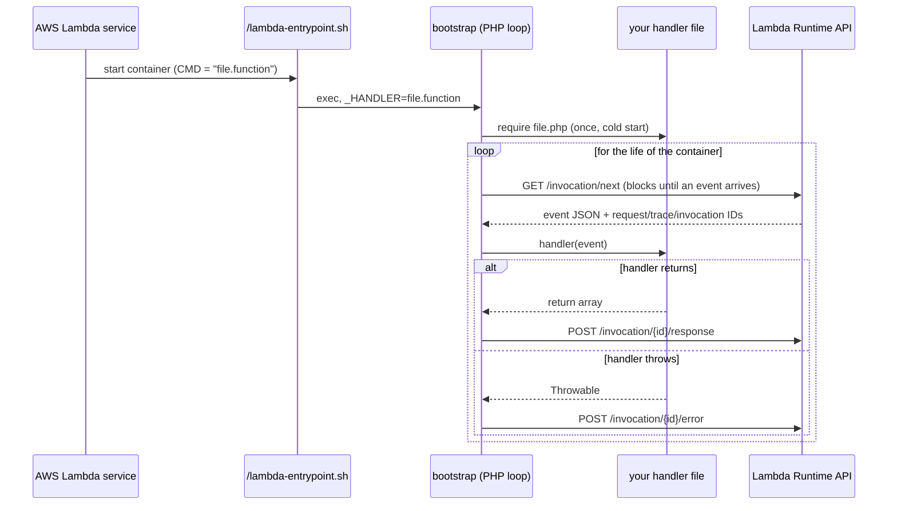

# php-aws-lambda-runtime

A minimal custom PHP runtime for AWS Lambda container images — no Bref,
no vendor-provided extension layers, just AWS's own `provided:al2023` base
image, PHP installed straight from Amazon Linux 2023's package repo, and a
~60-line runtime loop.

## Why

Existing PHP-on-Lambda tooling (Bref and friends) is great until you need
an extension it doesn't ship a prebuilt layer for, or a version it doesn't
support yet — then you're stuck vendoring custom layers, pinning to
whatever version the maintainer got around to building, or fighting a
build pipeline you don't control. AL2023's own package repo already ships
PHP 8.1 through 8.5 with most common extensions (`mbstring`, `gd`, `xml`, `pdo`, ...),
and anything it doesn't ship (like `ext-mongodb` here) compiles from PECL
source in a few lines. Once you've seen that, the "runtime" part of a
custom Lambda runtime turns out to be small enough to just own outright.

## How it works

AWS Lambda container images work by running a fixed `ENTRYPOINT`
(`/lambda-entrypoint.sh`, baked into the base image) with `CMD` as its one
argument — the *handler name*. Everything else is up to you. This repo's
entire runtime is one PHP script (`bootstrap`) that gets installed at
`/var/runtime/bootstrap`: it parses the handler name once, `require`s your
handler file, then loops forever polling Lambda's Runtime API for the next
event and POSTing back whatever your handler function returns.



The cold start only happens once per container — every invocation after
that reuses the same booted PHP process, which is what makes this fast
enough for a real framework (see the Laravel example) rather than just a
toy.

The `_HANDLER` string follows a simple `<file>.<function>` convention,
parsed on the *first* dot only:

```php
[$handlerFile, $handlerFunction] = explode('.', getenv('_HANDLER'), 2);
require getenv('LAMBDA_TASK_ROOT') . '/' . $handlerFile . '.php';
```

So `CMD ["example.handler"]` loads `example.php` and calls `handler()` in
it. Because the split is on the first dot, your handler *file* name can't
itself contain a dot — `handler.example.php` would parse as file
`handler`, function `example.php`, which breaks. Keep the filename plain.

### What each invocation does beyond calling your handler

Every `GET /invocation/next` response carries a few headers the loop acts
on before it calls your handler:

- **`Lambda-Runtime-Trace-Id`** is copied into the `_X_AMZN_TRACE_ID`
  environment variable (and cleared when the header is absent). The AWS
  SDK and the X-Ray SDK read that variable, so this is what lets traces
  from inside your handler attach to the right request.
- **`Lambda-Runtime-Invocation-Id`**, when present, is sent straight back
  as a header on the `/response` and `/error` POSTs. Lambda uses it to
  confirm the runtime is answering the invocation it was actually handed.
- **`Lambda-Runtime-Aws-Request-Id`** is put into an `AWS_LAMBDA_REQUEST_ID`
  environment variable your handler can read. A custom runtime doesn't get
  the per-request context object the managed runtimes hand you, so this is
  the only place that id exists — useful for tagging log lines so you can
  pull one invocation's output back out of CloudWatch.

If your handler throws, the loop catches it and POSTs to
`/invocation/{id}/error` instead — a JSON body with `errorMessage`,
`errorType`, and `stackTrace` (`$e->getTrace()`) — so the failure shows
up in Lambda's own metrics and logs rather than hanging the invocation.

## Repo layout

```
core/                    framework-agnostic runtime - copy this as-is
  bootstrap               the runtime loop described above
  Dockerfile               minimal example: install PHP, copy bootstrap + handler
  example.php              a trivial handler that echoes the event + current datetime
  docker-compose.yml       docker compose up --build, then ./invoke.sh
  invoke.sh                POST a raw JSON event to the local RIE

examples/laravel-mongodb/  a real, working example: Laravel HTTP + SQS queue
  Dockerfile               multi-stage: compiles ext-mongodb from PECL, composer install
  http.php                 bridges API Gateway/Function URL events into Laravel's HTTP kernel
  queue.php                bridges SQS events into Laravel's queue job pipeline
  LambdaSqsJob.php          minimal Job implementation for the queue bridge
  invoke-http.sh            local HTTP invoke helper
  invoke-sqs.sh             local SQS invoke helper
  make-test-job.php         dev helper: generates a real serialized job payload for testing
```

## Quickstart

```
cd core
docker compose up --build -d
./invoke.sh '{"hello": "world"}'
```

You should get back:

```json
{"message": "Hello from a custom PHP Lambda runtime", "datetime": "2026-08-14 12:34:56", "event": {"hello": "world"}}
```

That's the whole loop working: container start → cold-start `require` →
Runtime API poll → your handler → response. From here, `core/Dockerfile`
is the template — add whatever `dnf install` lines your app needs, point
`CMD` at your own handler file, and you have a working custom runtime.

For a worked example that goes further — a real Laravel app, HTTP routing
through the actual middleware stack, and SQS-triggered queue jobs — see
[`examples/laravel-mongodb/README.md`](examples/laravel-mongodb/README.md).

## Default PHP modules

Installing `php<version>` + `php<version>-cli` from the AL2023 package
repo (as both Dockerfiles do) pulls in roughly the following modules by
default — captured against PHP 8.3, so treat it as a baseline rather than
an exact list for every version:

```
bz2, calendar, Core, ctype, curl, date, dom, exif, fileinfo, filter, ftp,
gettext, hash, iconv, json, libxml, openssl, pcntl, pcre, Phar, posix,
random, readline, Reflection, session, shmop, SimpleXML, sockets, SPL,
standard, sysvmsg, sysvsem, sysvshm, tokenizer, xml, xmlreader, xmlwriter,
xsl, zlib
```

Anything beyond this list (`mbstring`, `gd`, `pdo`, ...) needs an explicit
`dnf install php<version>-<extension>` line, or — if it isn't packaged for
AL2023 at all (like `ext-mongodb`) — compiling from PECL source, as shown
in the Laravel example.

## Choosing a PHP version

Both `core/Dockerfile` and `examples/laravel-mongodb/Dockerfile` default
to PHP 8.5, but take a `PHP_VERSION` build arg so you can pin any version
AL2023 currently packages (8.1 through 8.5 as of this writing — AWS adds
new ones over time; check the
[AL2023 PHP docs](https://docs.aws.amazon.com/linux/al2023/ug/php.html)
for the current list) — no fork or edit required, just override the arg:

```
docker build --build-arg PHP_VERSION=8.3 -t my-runtime core/
```

Or in `docker-compose.yml`:

```yaml
services:
  runtime:
    build:
      context: .
      args:
        PHP_VERSION: "8.3"
```

This works because every `dnf install` line in both Dockerfiles installs
`php${PHP_VERSION}` and its `-cli`/`-mbstring`/etc. siblings rather than a
hardcoded version — the Laravel example's compiled `ext-mongodb` module
path (`/usr/lib64/php${PHP_VERSION}/modules/mongodb.so`) is templated the
same way, so switching versions doesn't leave a stage still building
against the old one. AL2023 only packages one PHP release per major.minor
(no patch-level pinning) — for that level of control you'd need to
compile PHP itself from source, which is outside what this repo covers.

## Deploying to real AWS Lambda

Two things bite people going from local Docker to real Lambda:

- **Architecture.** If you're building on Apple Silicon, `docker build`
  defaults to `arm64`. If your Lambda function is configured for the
  default `x86_64`, you'll get `Runtime.InvalidEntrypoint` — the image
  simply can't execute on that CPU architecture. Either build with
  `docker buildx build --platform linux/amd64` or set the function's
  architecture to `arm64` to match. There's no code difference either way.
- **Handler selection.** `CMD` (not an environment variable) is what
  actually selects the handler — `/lambda-entrypoint.sh` does
  `export _HANDLER="$1"` unconditionally from its one CMD argument, which
  clobbers any inherited `_HANDLER` env var. If you need two functions
  from one image (e.g. HTTP + an SQS worker, as in the Laravel example),
  override each Lambda function's container `command:`/`ImageConfig`, not
  an environment variable.

## License

MIT — see [LICENSE](LICENSE).
