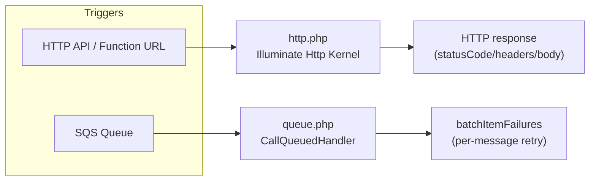

# Example: Laravel + MongoDB

A working example of the [core runtime](../../core) wired into a real
Laravel app, handling both HTTP requests and SQS-triggered queue jobs from
the same Docker image.



Same `bootstrap` loop, same image — which handler file runs is decided
entirely by each Lambda function's `CMD`/`command:` override (see the main
README's note on why that has to be `CMD`, not an env var).

## Setup

1. Copy this directory into your Laravel app's repo root as `aws-lambda/`.
2. Move `aws-lambda/docker-compose.yml` up to your repo root, next to
   `composer.json` — its build context has to be `.` (the repo root) for
   the Dockerfile's `COPY . .` step to see the whole app.
3. `docker compose up --build -d`

This brings up two services sharing the same build — one for HTTP
(`app`, port 9000) and one for the worker (`worker`, port 9001, overriding
`command:` to `queue.handler`).

## Testing

HTTP:

```
aws-lambda/invoke-http.sh GET /
aws-lambda/invoke-http.sh POST /api/login '{"username": "someone", "password": "secret"}'
```

SQS (generates a real Laravel-serialized job payload first, via Laravel's
own `Queue::createPayload()`, then posts it as an SQS event):

```
BODY=$(docker exec <worker-container> php aws-lambda/make-test-job.php 'App\Jobs\SomeJob' arg1)
aws-lambda/invoke-sqs.sh "$BODY"
```

A successful run returns `{"batchItemFailures": []}`. A failing job
returns the specific failed message's `itemIdentifier` so only that
message gets redelivered — not the whole batch.

## Design notes

- **`ext-mongodb` is compiled from PECL source** in a separate Dockerfile
  stage, since AL2023 doesn't package it. If your app uses a different
  unpackaged extension, this stage is the template.
- **`ext-pdo` is installed even though this app never touches a relational
  database.** `mongodb/laravel-mongodb`'s `Connection` class extends
  Laravel core's `Illuminate\Database\Connection`, which references the
  `PDO` class in its own property/method signatures — so PHP fatals the
  moment that class loads without the extension present, regardless of
  which driver you actually use.
- **`queue.php` doesn't construct a real `Illuminate\Queue\Jobs\SqsJob`.**
  That class talks to a live `SqsClient` for `delete()`/`release()`, but
  Lambda's own SQS event source mapping already owns message lifecycle —
  it deletes on a successful return and redelivers via the queue's redrive
  policy on failure. `LambdaSqsJob` extends the base
  `Illuminate\Queue\Jobs\Job` class directly, whose default
  `delete()`/`release()` are harmless no-ops, and reports failures back to
  Lambda via `batchItemFailures` instead of calling the SQS API itself.
- **`queue.php` returns a plain array, not a JSON string.** `bootstrap`
  already runs `json_encode()` on whatever the handler returns (same as
  `http.php`). If `queue.php` returned `json_encode(['batchItemFailures'
  => ...])` itself, the value would be encoded twice and Lambda would get
  the string `"{\"batchItemFailures\":[]}"` instead of an object. The SQS
  event source mapping can't read the `batchItemFailures` key out of a
  string, so it treats every batch as a total failure — nothing gets
  deleted, everything is redelivered until `maxReceiveCount`, and healthy
  messages pile into the DLQ. Return the array; let `bootstrap` encode it
  once.
- **The `Job-Started` / `Job-Finished` / `Job-Failed` log lines are an
  observability example, not required plumbing.** `queueJobLogContext()`
  writes one JSON line per job with its name, id, and attempt count.
  `queueJobIdProperties()` reflects on the deserialized job command and
  adds any property whose name ends in `id` (e.g. `orderId`,
  `customerId`), so the logs carry the job's own identifiers without this
  file needing to know any specific job class. Drop both helpers if you
  don't want the noise — the handler works the same without them.
- **No dead-letter queue means no escape hatch.** If a job's failure
  condition never resolves, `batchItemFailures` will keep telling SQS to
  redeliver it — forever, unless the source SQS queue has a
  `RedrivePolicy` with a `maxReceiveCount` and a DLQ configured. That's
  queue infrastructure, not something this code can fix on its own.
